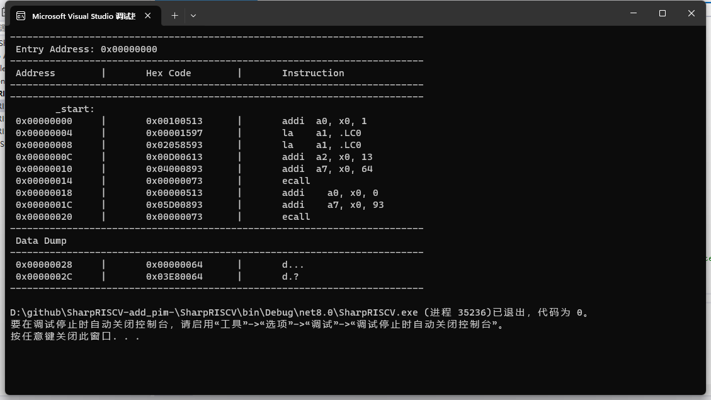
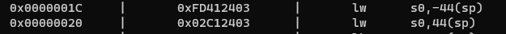

# SharpRISCV #
## 增加数据段对.half类型的支持



​		测试.s代码位于Example


## 命令符与寄存器之间不能存在制表符

- 原因：string op = instruction.Split(' ')[0];在解析opcode的时候通过空格划分，识别不了制表符

- 解决：在IdentifyInstructionType中对输入的指令进行"\t"与" "的转换


## load类指令不支持负数寻址

- 原因：I型指令的正则匹配没有包含匹配负的立即数

- 解决：

  ```
  //原I型指令匹配
  iTypeRegex = new Regex(@"^(\w+)\s+(\w+)\s*,\s*([\w.%()]*)$");
  var iSourceRegex = new Regex(@"^(([\w%]*\([^)]+\))|\d+)\(([^)]+)\)$");
  
  //修改后
  iTypeRegex = new Regex(@"^(\w+)\s+(\w+)\s*,\s*(-?[\w.%()]*)$");
  var iSourceRegex = new Regex(@"^(([\w%]*\([^)]+\))|-?\d+)\(([^)]+)\)$");
  ```

  

  

  

​	**正则表达式：**

- \w对应word，\s对应空格，+表示匹配一项或多项，*表示匹配零项或多项，?表示可有可无，|表示或
- 一个括号对应一个匹配项，匹配项即iTypeMatch.Groups，第0项为整体，第二项为第一个括号，以此类推

​	**反码与补码：**

- 用补码表示负数，第一位表示正负。以4bit有符号数为例，正数与负数一一对应，除了0和8，0和8的补码为自己
- 为什么不用反码，因为0的反码不是0，会出现正零和负零
